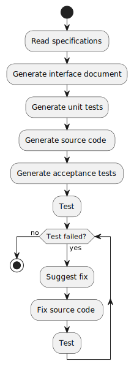
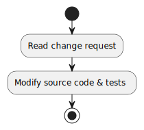

# App Builder AI

App Builder AI is a system that automatically develops and tests your app with an LLM (Large Language Model).


## How it works

Develop & Test:
1. The user provides a specification of the app they want to build.
2. The system generates source code and tests for the app.
3. The system executes the tests and suggests fixes for failing tests until all tests pass.

Change request:
1. The user provides a change request for the app.
2. The system modifies source code and tests for the change request.

| Develop & Test:                                      | Change request <br> (`--change-request`): |
|-----------------------------------------------------|--------------------------------------------|
|           |  |


## Quickstart

1. Clone repo
   ```
   git clone git@github.com:WillBooster/app-builder-ai.git
   cd app-builder-ai
   ```
3. Install `poetry` and `python`

   We recommend using [`asdf`](https://asdf-vm.com/):
   ```
   asdf install
   ```
4. Install packages
   ```
   poetry install
   ```
5. Create `.env` and set your OpenAI API key
   ```
   echo "OPENAI_API_KEY=[Your OpenAI API Key]" > .env
   ```
6. Run
   ```
   poetry run python app_builder/main.py
   ```


## Demo

Here, we build a CLI-based Minesweeper as an example. First, we prepare a specification of the app we want to build.

`minesweeper.txt`:
```
Minesweeper is a logic game where the objective is to clear a grid of tiles without detonating any hidden mines.

## Board Initialization
- The board size is 9x9.
- There are 10 mines.

## Gameplay
- Each turn, the game displays the board and prompts the player for a command.
- The player can reveal a tile or flag it as a potential mine.
- Revealing a tile will display:
  - The number of mines in adjacent tiles.
  - A mine (ending the game if one is revealed).
  - A blank space if there are no adjacent mines. This will also reveal all adjacent tiles.

## Commands
- `r x y`: Reveals the tile at position (x, y). index starts at 0.
- `f x y`: Flags the tile at position (x, y) as a potential mine. If the tile is already flagged, the flag is removed.

## Game Completion
- The game ends if a mine is revealed.
- The game is won if all non-mine tiles are revealed.

## Board Representation
The board should be represented textually with the following symbols:
- `.`: A concealed tile.
- `F`: A flagged tile.
- `1-8`: A revealed tile with the respective number of adjacent mines.
- ` ` (blank): A revealed tile with no adjacent mines.
- `*`: A mine (only shown if revealed or after the game ends).
```

Then, we run the App Builder AI.

```
$ poetry run python app_builder/main.py --spec ~/minesweeper.txt
08/17/2023 02:06:25 INFO: Generating public interface document.
08/17/2023 02:06:57 INFO: Generating __unit_test_board.py.
08/17/2023 02:07:23 INFO: Generating __unit_test_tile.py.
08/17/2023 02:07:35 INFO: Generating __unit_test_game.py.
08/17/2023 02:08:07 INFO: Generating board.py.
08/17/2023 02:08:34 INFO: Generating tile.py.
08/17/2023 02:08:41 INFO: Generating game.py.
08/17/2023 02:08:54 INFO: Generating minesweeper.py.
08/17/2023 02:09:11 INFO: Updating public interface document for board.py.
08/17/2023 02:09:18 INFO: Updating public interface document for tile.py.
08/17/2023 02:09:25 INFO: Updating public interface document for game.py.
08/17/2023 02:09:30 INFO: Updating public interface document for minesweeper.py.
08/17/2023 02:09:34 INFO: Generating acceptance test scenarios.
08/17/2023 02:09:55 INFO: Generating acceptance tests.
08/17/2023 02:09:55 INFO: Generating __acceptance_test_0_minesweeper.py.
08/17/2023 02:10:14 INFO: Generating __acceptance_test_1_minesweeper.py.
08/17/2023 02:10:26 INFO: Generating __acceptance_test_2_minesweeper.py.
08/17/2023 02:10:35 INFO: Generating __acceptance_test_3_minesweeper.py.
08/17/2023 02:10:51 INFO: Generating __acceptance_test_4_minesweeper.py.
08/17/2023 02:11:41 INFO: Generating __acceptance_test_5_minesweeper.py.
```

Great! The system generated source code and tests for us. It still continues:

```
08/17/2023 02:11:54 INFO: Creating source code vector database.
100%|█████████████████████████████████████████████████████████████████████████████████████████████████████████████████████████████████████████████████████| 13/13 [00:00<00:00, 1651.95it/s]
08/17/2023 02:11:56 INFO: Loading faiss with AVX2 support.
08/17/2023 02:11:56 INFO: Successfully loaded faiss with AVX2 support.
08/17/2023 02:11:56 INFO: Executing all tests (__unit_test_*.py).
08/17/2023 02:11:58 INFO: Fixing test errors.
08/17/2023 02:11:58 INFO: Generating source code fix for __unit_test_game.py.
We are now trying to fix for acceptance test __unit_test_game.TestGame.test_is_game_over.
Error message:
Traceback (most recent call last):
  File "/home/ss0201/ghq/github.com/WillBooster/app-builder-ai/app_builder/workspace/src/__unit_test_game.py", line 31, in test_is_game_over
    self.game.board.tiles[0][0].mine = True
    ~~~~~~~~~~~~~~~~~~~~~^^^
IndexError: list index out of range


Fix 1 - __unit_test_game.py:
The test_is_game_over method is trying to access a tile that has not been initialized yet. This is causing an IndexError.
Before setting the mine, make sure that the board is properly initialized. You can do this by calling the initialize_board method of the board instance in the setUp method of the TestGame class. This will ensure that the tiles list is populated before any tests are run.

Fix 2 - game.py:
The start method in the Game class does not initialize the board. This could lead to similar errors in the future.
Call the initialize_board method of the board instance in the start method of the Game class. This will ensure that the board is properly initialized whenever a new game is started.

Fix 3 - Specify a fix manually.
Which fix do you want to apply? (Enter a number):
```

Now, it seems like the system has found a bug in the code. Looking at the code, `tiles` is not initialized in `Board` and `start` does not call `initialize_board`.

```python
class Game:
    def start(self):
        self.board = Board()

    ...
```

```python
class Board:
    def __init__(self):
        self.tiles = []

    def initialize_board(self):
        self.tiles = [[Tile() for _ in range(9)] for _ in range(9)]
        ...
```

The fix 2 seems to be a good solution. Let's apply it.

```
Which fix do you want to apply? (Enter a number): 2
08/17/2023 02:16:35 INFO: Generating source code fix for game.py.
08/17/2023 02:17:09 INFO: Fixed game.py.
```

Great! The system fixed the bug.

```python
class Game:
    def start(self):
        self.board = Board()
        self.board.initialize_board()

    ...
```

This continues until all bugs are fixed.

```
08/17/2023 02:17:09 INFO: Updating public interface document for game.py.
08/17/2023 02:17:17 INFO: Creating source code vector database.
100%|█████████████████████████████████████████████████████████████████████████████████████████████████████████████████████████████████████████████████████| 13/13 [00:00<00:00, 1692.41it/s]
08/17/2023 02:17:19 INFO: Executing all tests (__unit_test_*.py).

... (continues until all bugs are fixed)
```
